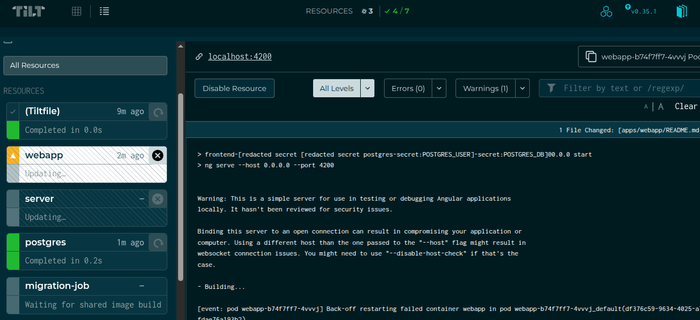

# FrontEnd - MiMoQ

## Local deployment no developing

if you just want to run th webapp without change any code, do nothing, tilt will take care of running the webapp, follow the [main README file](../../Readme.md) 

## Local development

for local development is better to run the webapp outside k8s cluster

1. Disable the pod in tilt 

2. Run the start command
 
 `npm run start`
